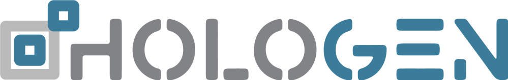

Open online resource for training materials from the [*HoloGen* MSCA Doctoral
Network](https://www.hologen-network.eu/). Each retreat below lists its full
programme of lectures and workshops. Slides are linked where the presenter has
agreed to share them openly; sessions without a link have no slides published.

Retreat dates are listed on the
[events page](https://www.hologen-network.eu/events.html).

::: {.callout-note}
Every retreat also includes project presentations by the doctoral candidates.
These cover ongoing internal work, so the material is not yet shared publicly.
:::

## Retreat 1 — Introduction to Hologenomics {#copenhagen-2025}

Copenhagen, May 2025. [Programme](material/training_material/2025-Copenhagen/Program.pdf)

- Torgeir Hvidsten — [Introduction to HoloGen & MSCA green charter guidelines](material/training_material/2025-Copenhagen/Day1_Introduction.pptx)
- Ostaizka Aizpurua — [Theoretical and practical introduction to hologenomics](material/training_material/2025-Copenhagen/Day1_Theoretical_and_practical_introduction_to_hologenomics.pptx)
- Marc Marti-Renom — Workshop: Individual PhD project presentations
- Torgeir Hvidsten — About HoloGen training network *(symposium)*
- Lindsay Hall — Shaping the infant hologenome *(symposium)*
- Karoline Faust — Interactions between human gut microbes *(symposium)*
- Ostaizka Aizpurua — Seizing causality *(symposium)*
- Gareth Difford — Quantifying host genetic and microbial contributions to trait variance *(symposium)*
- Leo Lahti — [Statistical programming framework for multi-source data integration](material/training_material/2025-Copenhagen/Day2_Statistical_programming_framework.pdf) *(symposium)*
- Aki Havulinna — Bayesian disease mapping for hologenomics in Finland *(symposium)*
- Kati Hanhineva — [Metabolomics analytics](material/training_material/2025-Copenhagen/Day2_Metabolomics_analytics.pptx) *(symposium)*
- Simen Rød Sandve — Atlantic salmon *(symposium)*
- Marc Marti-Renom — The discovery of fossil chromosomes *(symposium)*
- Antton Alberdi — [A PhD student's voyage: purpose, strategy, task management](material/training_material/2025-Copenhagen/Day3_PhD_student_voyage_I.pptx)
- Ostaizka Aizpurua — [Research ethics](material/training_material/2025-Copenhagen/Day3_Research_ethics.pptx)
- Antton Alberdi — [Task and conflict management](https://drive.google.com/file/d/18wuHdRaZbnEKgPq1-QyixlGpn5iQopTX/view) *(video)*
- Leo Lahti — [Introduction to code and data management I & II](material/training_material/2025-Copenhagen/Day3_intro_to_code_and_data_management.pdf)
- Leo Lahti — [Introduction to statistical concepts and methods](material/training_material/2025-Copenhagen/Day4_intro_to_statistical_concepts.pdf)
- Antton Alberdi — [A PhD student's voyage II](material/training_material/2025-Copenhagen/Day5_PhD_student_voyage_II.pptx)
- Torgeir Hvidsten — HoloGen going forward

## Retreat 2 — High-Throughput Profiling {#barcelona-2025}

Barcelona, November 2025. [Programme](material/training_material/2025-Barcelona/Program.pdf)

- Torgeir Hvidsten — [Introduction to HoloGen](material/training_material/2025-Barcelona/Day1_Introduction.pptx)
- Pranvera Hiseni — Industry: Genetic Analysis
- Kati Hanhineva — [Industry: Afekta](material/training_material/2025-Barcelona/Day2_Industry_Afekta.pptx)
- Nicole Reisinger — Industry: DSM-Firmenich
- Ostaizka Aizpurua — Industry: Ziba
- Ostaizka Aizpurua — Sequencing technologies for hologenomics
- Ostaizka Aizpurua — Workshop: Metagenomics — data generation and design considerations
- Leo Lahti — [Workshop: Metagenomics — downstream data analysis](material/training_material/2025-Barcelona/Day3_Metagenomics_downstream_analysis.pdf)
- Nikolai (CNAG) — Workshop: Modelling the intestinal environment with Gorgona
- Workshop: Communicating Across Cultures
- Torgeir Hvidsten — HoloGen going forward

## Retreat 3 — Data analysis and Open Science {#turku-2026}

Turku, May 2026. [Programme](material/training_material/2026-Turku/Program.pdf)

- Leo Lahti — [Welcome & introduction](material/training_material/2026-Turku/Day1_Introduction.pptx)
- Lindsay Hall — Communication activities & storyboarding
- Susanna Repo (ELIXIR) — Data management, database resources in life sciences
- Karoline Faust — [Methods for studying host–microbiota interactions](material/training_material/2026-Turku/Day3_Methods_for_studying_host_microbiota_interactions.pdf)

## Retreat 4 — Dissemination, Exploitation and Communication {#leuven-2026}

Leuven, October 2026. [Preliminary programme](material/training_material/2026-Leuven/Program.pdf)

- Torgeir Hvidsten — Announcements
- Lindsay Hall — Science communication and outreach
- Lindsay Hall / Jennifer — Workshop: Scientific writing exercise
- Tina — DCs meet the PhD coordinator: career development
- Karoline Faust — Welcome and introduction to community modelling
- Ksenia Guseva — Metacommunities of soil microbiomes: patterns, processes and implications for inference
- Julien Tap — Multiscale associations between diet and the gut microbiome in a nationwide French cohort
- Lulla Opatowski — Application of meta-community modelling to pathogens spreading in hospitals
- Ksenia Guseva / Karoline Faust — Workshop: Tutorial on community modelling
- Leo Lahti — Methods and strategies of scientific data visualisation
- Simen Rød Sandve — Best practices for not failing with PowerPoint presentations
- Aki Havulinna — Application case: species distribution modelling and visualisation
- Jan Aerts (KU Leuven) — Introduction to data visualisation techniques
- Ivo De Baere (KU Leuven) — Presentation on patents, with notes on copyright and trademarks
- Torgeir Hvidsten — Wrap-up

{width=20% fig-align="left"}

This project has received funding from the European Union's Horizon 2023
programme under grant agreement No 101169005.
